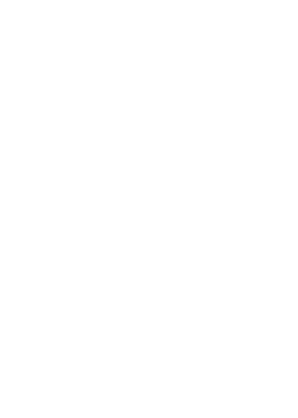

  

   
   

  
  
  
  

 

> Building practical AI systems, research tools, and product experiences — with care for how agents learn, coordinate, and stay accountable.

## Research

<table width="100%" cellpadding="18" bgcolor="#20262D">
  <tr>
    <td width="22%" align="center" valign="middle">
      
    </td>
    <td valign="middle">
      <strong>SIA — Self-Improving Agents</strong>  
      <strong>A Portable, Host-Agnostic Instruction Framework for Self-Correcting AI Coding Assistants</strong>  
      A research preprint and validation report on project-adaptive agent instructions, evidence capture, scoped subagent collaboration, and procedural learning from real implementation feedback.  
      
      
      
        
      Download the package, place it in a project, and ask your coding assistant to read <code>sia/AGENT.md</code>.
    </td>
  </tr>
</table>

  
<strong>Research focus</strong>

   

  - Multi-agent coordination and scoped task ownership
  - Evidence-grounded feedback loops for coding assistants
  - Agent safety, approvals, and project-specific adaptation
  - Reliable developer tooling and AI-assisted product systems

Additional research papers

<table width="100%" cellpadding="18" bgcolor="#20262D">
  <tr>
    <td width="22%" align="center" valign="middle"></td>
    <td valign="middle">
      <strong>The Synthesis Layer</strong>  
      Reducing Command Authority Bottleneck in Production Multi-Agent AI Systems  
      
      
    </td>
  </tr>
  <tr><td colspan="2" height="2" bgcolor="#373A3F"></td></tr>
  <tr>
    <td width="22%" align="center" valign="middle"></td>
    <td valign="middle">
      <strong>MURPHY</strong>  
      Conversational Intent Surveillance with Arc-Based Trajectory Detection for Safe Multi-Agent AI Systems  
      
      
    </td>
  </tr>
  <tr><td colspan="2" height="2" bgcolor="#373A3F"></td></tr>
  <tr>
    <td width="22%" align="center" valign="middle"></td>
    <td valign="middle">
      <strong>SAGE</strong>  
      Self-Adapting Governance Engine for Multi-Agent AI Systems  
      
    </td>
  </tr>
  <tr><td colspan="2" height="2" bgcolor="#373A3F"></td></tr>
  <tr>
    <td width="22%" align="center" valign="middle"></td>
    <td valign="middle">
      <strong>ILP</strong>  
      Instruction Layer Protocol for Multi-Agent AI Systems  
      
      
    </td>
  </tr>
</table>

## Skills & tools

<table width="100%" cellpadding="16" bgcolor="#20262D">
  <tr>
    <td width="25%" valign="middle"><strong>AI &amp; agent systems</strong> Design, orchestration, safety</td>
    <td valign="middle">
      
      
      
      
    </td>
  </tr>
  <tr><td colspan="2" height="2" bgcolor="#373A3F"></td></tr>
  <tr>
    <td width="25%" valign="middle"><strong>Software engineering</strong> Full-stack product development</td>
    <td valign="middle">
      
      
      
      
      
    </td>
  </tr>
  <tr><td colspan="2" height="2" bgcolor="#373A3F"></td></tr>
  <tr>
    <td width="25%" valign="middle"><strong>Cloud &amp; data</strong> Infrastructure and persistence</td>
    <td valign="middle">
      
      
      
      
      
    </td>
  </tr>
</table>

## Open source

<table width="100%" cellpadding="16" bgcolor="#20262D">
  <tr>
    <td width="25%" valign="middle"><strong>RRQ</strong> Autonomous YouTube Production System</td>
    <td valign="middle">
      
      
    </td>
  </tr>
  <tr><td colspan="2" height="2" bgcolor="#373A3F"></td></tr>
  <tr>
    <td width="25%" valign="middle"><strong>Asset Tracker Pro</strong> Asset tracking and management</td>
    <td valign="middle">
      
      
    </td>
  </tr>
</table>

“Still learning with machines.”

